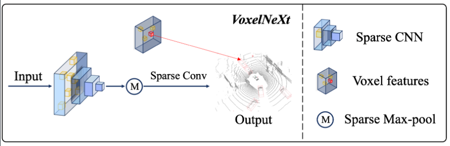
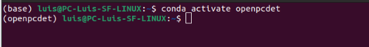
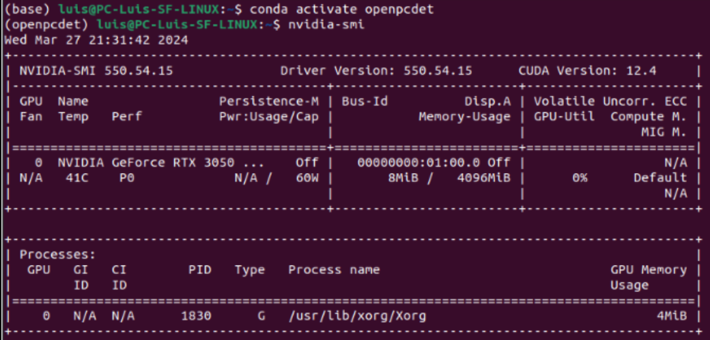
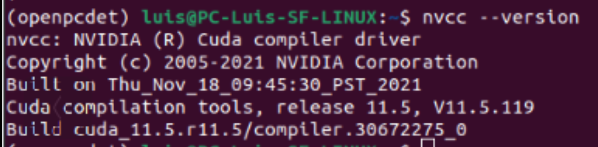
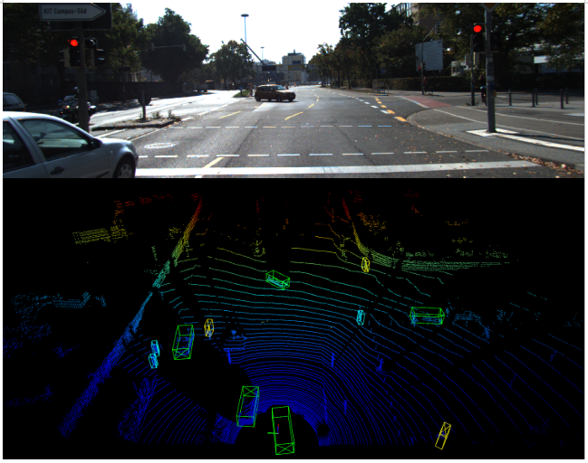

# VoxelNext_Projektarbeit HKA_WS_23-24
3D-Object Detection for Autonomous Driving: Implementation of VoxelNext model with nuScenes and KITTI Dataset. 

In this project we try to reproduce the results of the paper "VoxelNeXt: Fully Sparse VoxelNet for 3D Object Detection and Tracking" (CVPR 2023)

**VoxelNeXt: Fully Sparse VoxelNet for 3D Object Detection and Tracking [[Paper](https://arxiv.org/abs/2303.11301)]** <br />
VoxelNeXt is a clean, simple, and fully-sparse 3D object detector. It predict objects directly upon sparse voxel features without sparse-to-dense conversion, anchors, or center proxies. The objective of this project is to reproduce the results of the mentioned paper and test the model with KITTI dataset.

<p align="center">
  
</p>

Hereby, We share a step by step guide from setting up the environment to visualization of the results. We also share some insights on solving some problems we faced during the execution of the program.

Project Members: Bibek Gupta, Luis Sanchez Fernandez, Lucia Montero Couso

University: Hochshule Karlsruhe of Applied Science (HKA)

Course of Study: EU4M Mechatronics (MMSM311)

Semester: Winter Semester 023-024


# Getting Started
The project is built upon OpenPCDet open-source library for LIDAR-based 3D object Detection. It is created by the OpenPCDet development team, built on PyTorch and supports variety of state of art 3D object Detection models. 

In the first phase we shall provide a step by step guide to install OpenPCDet using Anaconda. (We tried installing OpenPCDet in Windows however, we faced difficulties during installation. So, we recommend to work with LINUX OS.)

Description of our PC Hardware and Software:

1. Operating System: Linux Ubuntu 22.04.4 LTS 
2. GPU: Nvidia Geforce RTX3050 4GB 
3. GPU Driver version: 550.54 	
4. CUDA Version: 12.4
5. CUDA Toolkit version: 11.8  
5. Python version: 3.11.8
6. Pytorch version: 2.2.1+cu118  
7. Anaconda version : 24.1.2
8. Open3D: 0.18

## STEP 1: Anaconda Installation
1. Download the Linux Version of Anaconda. (https://www.anaconda.com/download) The file should be downloaded as a bash file. (.sh extension)

2. Navigate to Downloads folder and open the properties window of the downloaded file, under the permission tab tick the execute file as a program box.
 
3. Open Terminal and navigate to the downloads directory. Run the bash file. (Note: Make sure to install Anaconda in the home directory not in the root directory.)

```shell script
cd Downloads
bash Anaconda3-2024.02-1-Linux-x86_64.sh
```

4. Keep pressing Enter to accept the License terms until you reach the end of file and type yes >> Enter

5. Next a prompt will appear confirming the installation location. Check the location for home directory and press ENTER.

6. After installation is complete, a prompt will appear to add the Anaconda to the path environment variable, type yes and press ENTER.

7. Close and reopen the terminal and (base) can be seen on the start which confirms anaconda is successfully installed with active environment as base.

8. It would be better to create a new environment for the installation of required libraries for the project. The below command creates a new environment with specifified python version libraries.

```shell script
conda create --name openpcdet python=3.11
```
9. After successfull execution, we change the active environment to the new one we created. (Note: After each terminal restart, the environment sets to the default base. So, need to activate the required environment each restart)

```shell script
conda activate openpcdet
```

10. After successful execution of the command above, environment shall be changed from  (base) to (openpcdet)

<p align="left">
  
</p>

## STEP 2: GPU Setup

1. Check for GPU availability

```shell script
lspci | grep -i nvidia
```
2. Check for Nvidia GPU driver version. 

```shell script
nvidia-smi
```
Note: It gives the overview of the GPU (Driver Version, Usage, GPU Name, Memory Usage etc.). If these details are not displayed or asks for an updated driver, follow the link from Nvidia official site below to select the correct GPU Series for your PC. Download and install the recent driver for the available GPU. It would be better to have the suggested updated driver installed as per the site.  https://www.nvidia.com/download/index.aspx 

3. System update and reboot

```shell script
sudo apt update && sudo apt upgrade -y
sudo reboot
```

5. Update the GPU driver

The driver file is downloaded as .run extension. So to proceed installation, open terminal and navigate to Downloads directory and run 

```shell script
sudo chmod +x filename.run
```

Note: During installtion end it will ask you to set up password to enroll in Machine Owner Key (MOK) for the next computer reboot. Select a average sized password and proceed to reboot. During reboot select "Enroll the MOK" option and input the set password. Need to be careful here because as you type the password the keys are not shown, so better to avoid mistakes and proceed. If a error occurs here, the OS shall run in secure boot mode and you need to setup the MOK again. Follow the below command to reset MOK and reboot. 

```shell script
sudo update-secureboot-policy --enroll-key
sudo reboot
```
After successful MOK, the driver shall be successfully installed. If the driver is correctly installed or updated, the nvidia-smi command shall show the desired updated driver version.  

<p align="left">
  
</p>

Note: In some cases of old GPU drivers, it may be required to complete uninstall and the old drivers and proceed with a clean installation.  Only, if there are difficulties while updating the current drivers.

## STEP 3:  CUDA Toolkit and CUDnn Installation

1. Open terminal and give the command as 

```shell script
nvcc --version
```

It gives you the currently installed CUDA toolkit version . If there is an error, CUDA toolkit and CUDnn needs to installed. We suggest to install the below mentioned versions for code compatibility. 

Since we worked with CUDA Toolkit 11, the download link from Nvidia official site is provided below.

https://developer.nvidia.com/cuda-11-8-0-download-archive    

Select the the .deb file for the OS architecture (Our OS config.: LINUX, x86, Ubuntu, 22.04, .deb(local)) and execute the command lines in terminal step by step.
 
Similarly, for installation of CUDnn ,the download link from Nvidia official site is provided below.

https://developer.nvidia.com/cudnn-downloads

Select the the .deb file for the OS architecture (Our OS config.: LINUX, x86, Ubuntu, 22.04, .deb(local)) and execute the command lines in terminal step by step. 
(Please Note: For the final command in terminal for CUDnn installation, it needs to be modified. If not, the recent version of CUDnn will be installed, which would result in compatibility errors with installed CUDA 11 version.) To be modified as below:  

```shell script
sudo apt-get -y install cudnn-cuda-11 
```

After successful installation of CUDA Toolkit and CUDnn, we have provided the snip of terminal window for our OS below.

<p align="left">
  
</p>

Not to be confused: The discrepancy between the CUDA versions reported by nvcc --version and nvidia-smi is due to the fact that they report different aspects of the system's CUDA setup. nvcc --version reports the version of the CUDA toolkit installed. This is the version that is used to compile CUDA code. 

## STEP 4: Pytorch Installation with CUDA 

1. The pytorch libraries could be downloaded from the official site link:

```shell script
https://pytorch.org/
```

Since, we used CUDA 11 version, we install pytorch with cuda118. Give the below command to the terminal. (Note: Check if the correct environment is activated. In this case openpcdet. Make sure to install all the necessary libaries in openpcdet env not the base environment.) 

```shell script
conda install pytorch torchvision torchaudio pytorch-cuda=11.8 -c pytorch -c nvidia
```
After successful installation, we check if pytorch detected out system GPU correctly. Open python in terminal and run below commands.

```shell script
python
import torch
torch.cuda.is_available()
torch.cuda.current_device()
torch.cuda.get_device_name(0)
```
Expected output : 

"True".

"0".

"NVIDIA GeForce RTX 3050".

After successful execution until this step, we can go further now to install the OpenPCDet Library.

## STEP 5: OpenPCDet Installation

1. Firstly, we need to install the Spatially Sparse Convolution Library (SpConv). The repository link : [Spconv](https://github.com/traveller59/spconv) .

Here, we download the Spconv for CUDA 11.8. 

```shell script
pip install spconv-cu118
```

2. Clone the OPenPCDet repository.

```shell script
git clone https://github.com/open-mmlab/OpenPCDet.git
```
Note: We recommend to clone the original OpenPCDet repository rather than this one, to avoid .cpp extension errors during installion. During training the model configuration files from this repository could be merged with OpenPCDet. (Further explained in STEP:7) 

* Navigate inside the OpenPCDet directory 

```shell script
cd OpenPCDet
```
* Install the neccessary libraries in requirements file.

```shell script
pip install -r requirements.txt
```
3. Build the OpenPCDet

```shell script
python setup.py develop 
```
Note: In case of "RuntimeError: Error compiling objects for extension." . We need to downgrade GCC version. CUDA 10 supports upto GCC8 and CUDA 11 supports upto GCC9. Follow the below code to proceed.

* List available GCC alternatives:

```shell script
sudo apt list gcc-9
```
* Install GCC-9 and G++-9 and set them as default compilers

```shell script
sudo apt install gcc-9 g++-9

export CC=/usr/bin/gcc-9

export CXX=/usr/bin/g++-9
```
* Rerun python setup.py develop 

* Successful Installation of OpenPCDet shall result in end as : 

Using /home/bibek/anaconda3/envs/openpcdet/lib/python3.7/site-packages.
Finished processing dependencies for pcdet==0.6.0+255db8f

At this stage we have sucessfully completed to install OpenPCDet and the required site packages. 
Now we proceed ahead to training dataset preparation.

## STEP 6: Dataset Preparation 

### KITTI Dataset

Please download the official [KITTI 3D object detection](http://www.cvlibs.net/datasets/kitti/eval_object.php?obj_benchmark=3d) dataset. Sign in is required to access the files. 

1. Download the required datasets: 

* Download left color images of object data set (12 GB)
* Download Velodyne point clouds, if you want to use laser information (29 GB)
* Download camera calibration matrices of object data set (16 MB)
* Download training labels of object data set (5 MB)
* The road planes could be downloaded from [road plane](https://drive.google.com/file/d/1d5mq0RXRnvHPVeKx6Q612z0YRO1t2wAp/view?usp=sharing)
* The precomputed depth maps could be downloaded from [depth maps](https://drive.google.com/file/d/1qFZux7KC_gJ0UHEg-qGJKqteE9Ivojin/view?usp=sharing) 

Note: The datasets are downloaded as .zip files. The files must be extracted and organized as per the format below:  

```
OpenPCDet
├── data
│   ├── kitti
│   │   │── ImageSets
│   │   │── training
│   │   │   ├──calib & velodyne & label_2 & image_2 & planes & depth_2
│   │   │── testing
│   │   │   ├──calib & velodyne & image_2
├── pcdet
├── tools
```

2.  Generate the data infos by running the following command:
   
```python 
python -m pcdet.datasets.kitti.kitti_dataset create_kitti_infos --cfg_file /home/bibek/OpenPCDet/tools/cfgs/dataset_configs/kitti_dataset.yaml
```
Note: File path to given where the OpenPCDet is located. (In our case: /home/bibek)

### NuScenes Dataset

1. Please download the official [NuScenes 3D object detection dataset](https://www.nuscenes.org/download) Sign is required to access the files.
  
Note: The datasets are downloaded as .zip files. The files must be extracted and organized as per the format below:
```
OpenPCDet
├── data
│   ├── nuscenes
│   │   │── v1.0-trainval (or v1.0-mini if you use mini)
│   │   │   │── samples
│   │   │   │── sweeps
│   │   │   │── maps
│   │   │   │── v1.0-trainval  
├── pcdet
├── tools
```

2. Install the `nuscenes-devkit` with version `1.0.5` by running the following command: 
```shell script
pip install nuscenes-devkit==1.0.5
```

3. Generate the data infos by running the following command (it may take several hours):
   
```python 
python -m pcdet.datasets.nuscenes.nuscenes_dataset --func create_nuscenes_infos --cfg_file /home/bibek/OpenPCDet/tools/cfgs/dataset_configs/nuscenes_dataset.yaml --version v1.0-mini
```

Note: Since we not work with Agroverse dataset we can comment out line 15 and line 27 in OpenPCDet/pcdet/datasets/init. py to avoid the Error: No module named ‘av2’ 

## STEP 7: Training, Evaluation and Visualization

We worked with single GPU Training and Testing, the commands for execution for the same is given below.

### Training and Evaluation with a single GPU:

1. Change current directory to
```shell script  
cd OpenPCdet/tools 
```
2. Run the train.py file  
```shell script
python train.py --cfg_file ${CONFIG_FILE}
```
One could optionally add extra command line parameters `--batch_size ${BATCH_SIZE}` and `--epochs ${EPOCHS}` to specify the preferred parameters. 

However, we changed the training parameters directly in the VoxelNext Model configuration file.

We share the path to the different configuration files where, training parameters and dataset parameters can be modified as per requirement:

* VoxelNext Model config. file path (v1.0-mini_3classes):
  
```shell script 
  --cfg_file /home/bibek/OpenPCDet/tools/cfgs/nuscenes_models/cbgs_voxel0075_voxelnext2.yaml
```
* VoxelNext Model config. file path (KITTI):
  
```shell script 
  --cfg_file /home/bibek/OpenPCDet/tools/cfgs/kitti_models/voxelnext.yaml
```

* NuScenes Dataset config. file path:

```shell script 
  --cfg_file /home/bibek/OpenPCDet/tools/cfgs/dataset_configs/nuscenes_dataset.yaml
```
Note: In the above file "VERSION:" to be assigned to v1.0-mini, v1.0-trainval or v1.0-test accordingly as per the dataset in use. 

* Kitti Dataset config. file path:
  
```shell script 
  --cfg_file /home/bibek/OpenPCDet/tools/cfgs/dataset_configs/kitti_dataset.yaml
```

* The sample code for our training results for nuScenes dataset is given as:

```shell script 
  python train.py --cfg_file /home/bibek/OpenPCDet/tools/cfgs/nuscenes_models/cbgs_voxel0075_voxelnext.yaml
```
Note: The same --cfg_file to be used to train for v1.0-mini, v1.0-trainval or v1.0-test nuScenes dataset.

* The sample code for our results for KITTI dataset is given as:
```shell script 
  python train.py --cfg_file /home/bibek/OpenPCDet/tools/cfgs/kitti_models/voxelnext.yaml
```

Note: As VoxelNext models is already incorporated in OpenPCDet repository, some of the config. files needs to be manually placed into the OpenPCDet>tools>cfgs folder after cloning. The modified config. files are available in this repository. (for e.g config. file for training nuScenes Model for 3 classes and Kitti model.)
We recommend to merge the "pcdet" and "tools" folder of this repository with the cloned and built OPenPCdet repository. 
 
### Testing

1. Change current directory to
```shell script  
cd OpenPCdet/tools 
```
2. Run the test.py file (to evaluate a single pretrained model)
```shell script
python test.py --cfg_file ${CONFIG_FILE} --batch_size ${BATCH_SIZE} --ckpt ${CKPT}
```
The sample code for our testing results for nuScenes dataset is given as:
```shell script
python test.py --cfg_file /home/bibek/OpenPCDet/tools/cfgs/nuscenes_models/cbgs_voxel0075_voxelnext.yaml --batch_size 10 --ckpt /home/bibek/OpenPCDet/output/home/bibek/OpenPCDet/tools/cfgs/nuscenes_models/cbgs_voxel0075_voxelnext/default/ckpt/latest_model.pth
```
The sample code for our testing results for KITTI dataset (validation set) is given as:
```shell script
python test.py --cfg_file /home/bibek/OpenPCDet/tools/cfgs/kitti_models/voxelnext.yaml --ckpt /home/bibek/OpenPCDet/output/home/bibek/OpenPCDet/tools/cfgs/kitti_models/voxelnext/default/ckpt/checkpoint_epoch_40.pth
```
To evaluate the results of the KITTI testing set, the below parameters needs to be replaced as below in the path OpenPCdet/tools/cfgs/dataset_configs/kitti_dataset.yaml file :
DATA_SPLIT: 'test': test
INFO_PATH: test': [kitti_infos_test.pkl]

```shell script
python test.py --cfg_file /home/bibek/OpenPCDet/tools/cfgs/kitti_models/voxelnext.yaml --ckpt /home/bibek/OpenPCDet/output/home/bibek/OpenPCDet/tools/cfgs/kitti_models/voxelnext/default/ckpt/checkpoint_epoch_40.pth --save_to_file
```

### Visualization

1. Open3D Visvalization tool Installation

```shell script  
 pip install open3d
```
2. Change current directory to
```shell script  
cd OpenPCdet/tools 
```
3. Run the Demo.py file
   ```shell script
   python demo.py --cfg_file ${CONFIG_FILE}
    --ckpt ${CKPT}
    --data_path ${POINT_CLOUD_DATA}
   ```
   
The sample code for our testing results for KITTI dataset is given as:
```shell script 
python demo.py --cfg_file /home/bibek/OpenPCDet/tools/cfgs/kitti_models/voxelnext.yaml --ckpt /home/bibek/checkpoint_epoch_40.pth --data_path /home/bibek/OpenPCDet/data/kitti/testing/velodyne/006946.bin
```

### Experimental Results

| KITTI Detection      |  Set |  Car |  Ped |   Cyc  | Link|
|---------------|:----:|:----:|:----:|:-----------:|:----------:|
| [VoxelNeXt](/home/bibek/Git/OpenPCDet/tools/cfgs/kitti_models/voxelnext.yaml)     |  val | 78.89 | 57.03 | 67.13 | [Pre-trained](/output/kitti_models_40_epochs/ckpt/checkpoint_epoch_40.pth) |
| [VoxelNeXt](/home/bibek/Git/OpenPCDet/tools/cfgs/kitti_models/voxelnext.yaml)     |  test | 73.28 | 42.19 | 59.25 | [Submission](https://www.cvlibs.net/datasets/kitti/user_submit_check_login.php?benchmark=object&user=75aa4c489274da0403a77a42819c8c7f0953acb5&result=99907bb5b5d9c0284c220bb374e5dce0062a83f2) |


<p align="center">
  
</p>

## Acknowledgements
* This work is built upon the [OpenPCDet](https://github.com/open-mmlab/OpenPCDet) and [Spconv](https://github.com/traveller59/spconv).
* We thank the authors for providing the official VoxelNeXt model architecture and configuration files. [VoxelNeXt](https://github.com/dvlab-research/VoxelNeXt.git).
  


  


